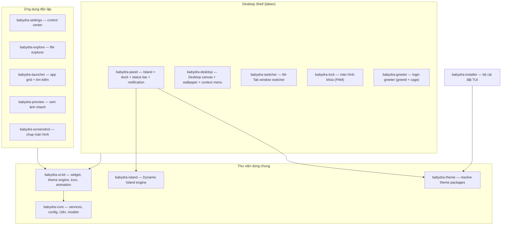

# 01 — Tổng quan dự án

**Phạm vi:** BabyDra là gì, các thành phần, mô hình phân nhánh.
**Phiên bản:** 2.0.0
**Cập nhật lần cuối:** 2026-08-17

---

## 1. BabyDra là gì?

BabyDra là một **môi trường desktop (Desktop Shell) Linux nhẹ** dành cho Arch Linux, viết bằng **Rust + GTK4 Layer Shell**, chạy trên compositor **labwc** (Wayland).

Mục tiêu:

- **Nhẹ & nhanh** — tận dụng GPU, FPS cao, không framework UI nặng.
- **Đẹp có chủ đích** — ngôn ngữ thị giác Glassmorphism, tokens đồng nhất (xem [09-design.md](./09-design.md)).
- **Mở rộng được** — mọi phần đều là module độc lập, theme/variant không cần sửa code.

> [!NOTE]
> Tài liệu này được viết theo mô hình 3 nhánh: `main` chỉ chứa bộ cài đặt + tài liệu, mã nguồn đầy đủ nằm trên `release` (mặc định) và `develop`. Xem mục 4.

---

## 2. Bản đồ thành phần



| Crate | Loại | Vai trò |
| :--- | :--- | :--- |
| `babydra-panel` | Binary | Island, dock, status bar, notification (daemon chạy nền) |
| `babydra-desktop` | Binary | Desktop canvas: icon lưới, hình nền, menu chuột phải, DBus FileManager1 |
| `babydra-switcher` | Binary | Alt-Tab: icon + preview cửa sổ |
| `babydra-lock` | Binary | Màn hình khóa, xác thực PAM |
| `babydra-greeter` | Binary | Màn hình đăng nhập cho greetd/cage (`/usr/bin`) |
| `babydra-settings` | Binary | Trung tâm cấu hình hệ thống |
| `babydra-explore` | Binary | Trình duyệt file GTK4 |
| `babydra-launcher` | Binary | App grid + fuzzy search |
| `babydra-preview` | Binary | Xem ảnh nhanh (image viewer) |
| `babydra-screenshot` | Binary | Chụp toàn màn hình / vùng chọn / cửa sổ |
| `babydra-core` | Lib | Services (wifi, vpn, volume, brightness, wallpaper…), config, i18n |
| `babydra-ui-kit` | Lib | Widget dùng chung, `init_theme`, icon, animation |
| `babydra-island` | Lib | Engine Dynamic Island + 3 feature mặc định |
| `babydra-theme` | Lib | Đọc/merge theme package từ đĩa |
| `babydra-installer` | Binary | Wizard cài đặt 10 bước (xem [03-setup.md](./03-setup.md)) |

---

## 3. Thư mục gốc nhìn nhanh

```text
BabyDra/
├── crates/       ← 9 ứng dụng (mỗi crate 1 binary)
├── libs/         ← 4 thư viện dùng chung (core, ui-kit, island, theme)
├── configs/      ← Cấu hình mẫu hệ thống (labwc, kitty, nvim, fastfetch, themes)
├── themes/       ← Theme packages (tokens.json + fonts.json + css/)
├── variants/     ← Variants (gói theme + app list + keybinds)
├── install/      ← Bộ cài đặt TUI (babydra-installer)
├── scripts/      ← install.sh, start.sh, update.sh, check.sh
├── tests/        ← Integration test suite (crate babydra-tests)
└── docs/         ← Tài liệu này
```

Chi tiết từng thư mục + quy chuẩn viết mã: [04-structure.md](./04-structure.md).

---

## 4. Mô hình phân nhánh

Kho mã nguồn theo mô hình 3 nhánh chính, tất cả do **tác giả** quản lý:

| Nhánh | Vai trò | Quyền hạn |
| :--- | :--- | :--- |
| `main` | Kênh phân phối — **chỉ chứa bộ cài đặt** (`install/`) và tài liệu | Chỉ tác giả |
| `release` | **Nhánh mặc định** — mã nguồn đầy đủ chính thức | Chỉ tác giả |
| `develop` | Nền tảng phát triển, tách ra từ `release` | Chỉ tác giả |

- Không ai ngoài tác giả push trực tiếp vào 3 nhánh trên.
- Người đóng góp **tạo nhánh riêng từ `develop`** và chỉ làm việc trong nhánh của mình.
- `babydra-installer` liệt kê mọi nhánh (trừ `main`) để cài đặt thử nghiệm.

Quy trình đóng góp: [CONTRIBUTING.md](../CONTRIBUTING.md).

---

## 5. Tiếp theo đọc gì?

| Bạn muốn… | Đọc |
| :--- | :--- |
| Hiểu kiến trúc & các pattern | [02-architecture.md](./02-architecture.md) |
| Cài đặt & build | [03-setup.md](./03-setup.md) |
| Code nằm ở đâu, viết code mới thế nào | [04-structure.md](./04-structure.md) |
| Tạo theme/variant riêng | [05-themes-variants.md](./05-themes-variants.md) |
| Hiểu luồng hoạt động từng thành phần | [06-system-flows.md](./06-system-flows.md) |
| Mở rộng Dynamic Island | [07-dynamic-island.md](./07-dynamic-island.md) |
| Tra cứu API | [08-apis.md](./08-apis.md) |
| Ngôn ngữ thiết kế / component | [09-design.md](./09-design.md) · [10-components.md](./10-components.md) |
