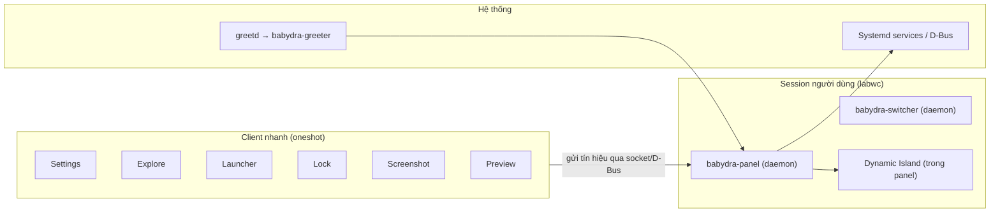
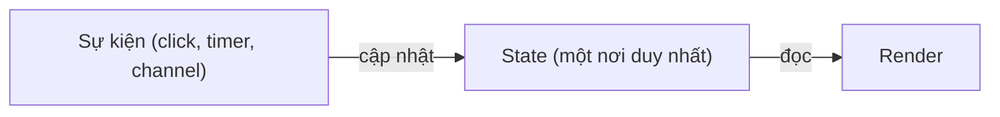
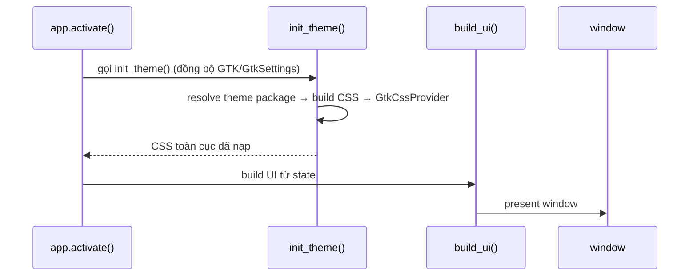

# 02 — Kiến trúc mã nguồn

**Phạm vi:** 4 pattern thiết kế cốt lõi, mô hình daemon-client, luồng khởi tạo chuẩn.
**Phiên bản:** 2.0.0
**Cập nhật lần cuối:** 2026-08-17

---

## 1. Sơ đồ tổng thể



---

## 2. Bốn pattern cốt lõi

### Pattern 1 — Phân tách Giao diện và Nghiệp vụ

Mọi widget đều tách file: **`mod.rs`** (struct, state, logic) và **`render.rs`** (chỉ vẽ UI).

```text
widgets/
├── mod.rs      ← struct + state + xử lý sự kiện (logic)
└── render.rs   ← fn render(): dựng GTK widget từ state (giao diện)
```

- Logic không biết GTK; render không chứa nghiệp vụ.
- Đổi giao diện không đụng logic, đổi logic không vỡ UI.

### Pattern 2 — Hướng trạng thái, luồng dữ liệu một chiều



- State là nguồn sự thật duy nhất; render chỉ là phép chiếu của state.
- Không có widget tự sửa dữ liệu rồi tự vẽ lại — mọi thay đổi đi qua state → render.

### Pattern 3 — Mô hình Daemon-Client

**Daemon** (panel, switcher) chạy nền, giữ cửa sổ nạp sẵn. **Client** (settings, launcher…) chạy nhanh, gửi tín hiệu rồi thoát.

```text
Client "mở settings" ──socket/D-Bus──▶ Daemon (panel)
                                        │ đã nạp sẵn cửa sổ
                                        ▼
                                     hiện cửa sổ ngay, không lag
```

### Pattern 4 — Module hóa Giao diện

UI chia theo widget độc lập, mỗi widget có API riêng (`create_*`), giao tiếp qua callback. Không widget nào import widget khác trực tiếp.

---

## 3. Quy trình khởi tạo cửa sổ chuẩn

Mọi ứng dụng GTK đều đi theo cùng một chuỗi:



> [!IMPORTANT]
> `init_theme()` là **điểm duy nhất** nạp theme — mọi crate đều gọi nó, không ai tự nạp CSS riêng. Chi tiết luồng theme: [05-themes-variants.md](./05-themes-variants.md) mục 3.

> [!NOTE]
> Ngoại lệ duy nhất: `libs/babydra-utils` chứa **widget GTK dùng chung** và được phép import GTK4, vì đây là tầng UI infrastructure, không phải nghiệp vụ.

---

## 4. Các service nền của babydra-core

`babydra-core` cung cấp các service không phụ thuộc GTK, dùng chung bởi mọi app:

| Nhóm | Service | Chức năng |
| :--- | :--- | :--- |
| Hệ thống | `system::wifi`, `system::vpn`, `system::volume`, `system::brightness`, `system::battery`, `system::cpu` | Đọc/điều khiển phần cứng (NetworkManager, WirePlumber, DDC/CI…) |
| Ứng dụng | `wallpaper`, `updates` | Đổi wallpaper, kiểm tra cập nhật |
| Nền | `daemon`, `tray_watcher`, `notification` | Lắng nghe system tray, gửi notification |
| Cấu hình | `config` | Đọc/ghi `~/.babydra/babydra.conf` (cache `OnceLock<RwLock>`) |
| Ngôn ngữ | `i18n` | Tra từ điển `locales/*/en.json`, `vi.json` |

**Luồng áp dụng cấu hình:** app khởi động → `load_babydra_config()` → `apply_all_saved_settings()` → các service đọc lại trạng thái đã lưu.

---

## 5. Câu hỏi thường gặp

| Câu hỏi | Trả lời |
| :--- | :--- |
| Vì sao panel là daemon mà settings là client? | Cửa sổ panel phải luôn sẵn sàng (không lag khi bấm), còn settings mở theo nhu cầu nên chạy oneshot. |
| Vì sao tách `mod.rs`/`render.rs`? | Đổi giao diện không đụng logic; dễ test state thuần không cần GTK. |
| Vì sao một nguồn theme duy nhất? | Đổi theme 1 nơi, áp dụng mọi app; tránh mỗi crate tự định nghĩa màu riêng. |
