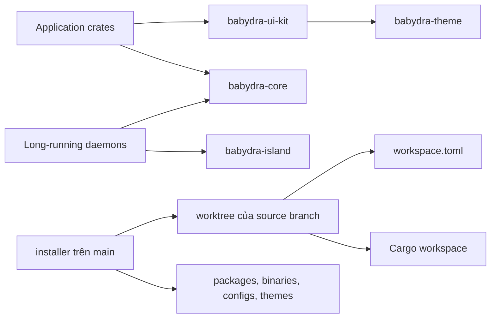

# 02 — Kiến trúc

## Phạm vi

Trang này mô tả các lớp chính của BabyDra, hướng phụ thuộc và các quyết định kiến trúc ảnh hưởng đến việc phát triển.

## Sơ đồ tổng thể



## Các lớp trách nhiệm

### Application crates

Mỗi thư mục trong `crates/` tạo một binary hoặc một nhóm binary có trách nhiệm gần nhau. Application giữ lifecycle GTK, event handling và orchestration của UI. Logic hệ thống dùng chung phải đi qua `babydra-core`, không sao chép vào từng crate.

### `babydra-core`

Đây là lớp service không phụ thuộc GTK. Nó cung cấp client cho NetworkManager, PipeWire, D-Bus, file system, power, wallpaper, configuration và i18n. Core có thể được test mà không cần mở cửa sổ.

### `babydra-ui-kit`

Đây là lớp component GTK4 dùng chung. Nó quy định cách tạo button, card, list, modal, switch, slider, icon và nạp CSS. Application không tự định nghĩa một biến thể UI nếu component chung đã đáp ứng.

### `babydra-island`

Island quản lý các view ngữ cảnh như media, notification, power, recording và clipboard. Panel là nơi khởi tạo island; library không phụ thuộc vào chi tiết layout của panel.

### `babydra-theme`

Theme library đọc package theme từ đĩa, giải quyết kế thừa, hợp nhất tokens và tạo CSS runtime. CSS layout dùng chung nằm trong ui-kit; CSS màu và token thuộc theme package.

### Installer

Installer là một crate độc lập trong `main`, không phụ thuộc GTK. Nó gồm bốn phần:

| Phần | Trách nhiệm |
| :--- | :--- |
| `models/` | State của binary, branch, variant, package và tiến trình cài đặt. |
| `system/` | Cargo discovery, git, worktree, manifest, sudo và thao tác hệ thống. |
| `tasks/` | Các bước copy binary, package, config, theme, service và greetd. |
| `ui/` | Wizard Ratatui, modal, log và progress. |

Installer không import crate của workspace nguồn. Ranh giới này cho phép `main` chạy trước khi source branch được checkout.

## Dependency direction

```text
application
    ├── babydra-ui-kit ─── babydra-theme
    └── babydra-core

babydra-panel ─── babydra-island ─── babydra-core

installer ─── filesystem / git / cargo / system commands
```

Các thư viện không được phụ thuộc ngược vào application. Nếu một service cần dùng ở nhiều nơi, chuyển nó vào core thay vì gọi trực tiếp binary khác.

## Khởi tạo ứng dụng GTK

Một ứng dụng GTK tiêu chuẩn thực hiện các bước sau:

```text
process start
    → parse arguments
    → create GTK application
    → initialize shared theme
    → load persisted configuration
    → build state and widgets
    → connect signals and services
    → present window or start daemon loop
```

Theme phải được khởi tạo trước khi render widget. Service nền không được chặn GTK main loop; dùng channel hoặc callback để đưa dữ liệu vào UI.

## Daemon và client

Daemon được khởi động cùng session và giữ state hoặc cửa sổ sẵn sàng. Client khởi động theo yêu cầu, gửi lệnh qua D-Bus hoặc socket rồi kết thúc hoặc giữ một cửa sổ ngắn hạn.

Ví dụ: launcher và settings là client; panel, switcher và keymap là daemon. Việc phân loại này không phải quy tắc cứng cho installer. Nếu một branch thêm daemon mới, scope cài đặt được khai báo trong `workspace.toml`.

## Quyết định về dữ liệu triển khai

Installer tách discovery và policy:

1. Cargo discovery tìm binary target và executable được build.
2. `workspace.toml` cung cấp policy branch-owned: tên cài đặt, source name, scope, package và GSettings.
3. Installer thực thi policy mà không cần biết tên project cụ thể.

Do đó, thêm binary là thay đổi ở branch nguồn. Sửa installer chỉ cần khi schema hoặc hành vi cài đặt chung thay đổi.
