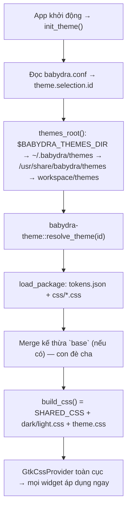

# 05 — Themes & Variants

**Phạm vi:** theme package, cách tạo theme/variant mới, luồng nạp CSS.
**Phiên bản:** 2.0.0
**Cập nhật lần cuối:** 2026-08-17

---

## 1. Khái niệm

| Thuật ngữ | Ý nghĩa |
| :--- | :--- |
| **Theme package** | Thư mục `themes/<theme-id>/` — màu sắc + font + CSS của toàn UI BabyDra |
| **Variant** | Gói `variants/<tên>/variant.toml` — theme + danh sách app + keybinds cho 1 bản phân phối |
| **selection** | 1 dòng trong `~/.babydra/babydra.conf` trỏ tới theme đang dùng |

---

## 2. Cấu trúc theme package

```text
themes/babydra-default/
├── tokens.json     ← design tokens (dark + light): surface, border, accent, font, radius
├── fonts.json      ← font families + fallbacks
└── css/
    ├── dark.css    ← lớp màu dark-mode (~2600 dòng)
    ├── light.css   ← lớp màu light-mode (~2700 dòng)
    └── theme.css   ← lớp override nạp cuối (đổi accent…)
```

`tokens.json` (schema là hợp đồng với engine `babydra-theme`):

```jsonc
{
  "name": "babydra-default",   // bắt buộc: khớp tên thư mục
  "base": null,                // kế thừa theme khác (vd "babydra-default")
  "dark":  { "surface": "rgba(14,14,18,0.96)", "border": "rgba(255,255,255,0.14)", "accent": "#3b82f6", "font": "…", "radius": { "pill": 9999, "lg": 20, "md": 16, "sm": 10 } },
  "light": { "surface": "rgba(255,255,255,0.98)", "border": "rgba(0,0,0,0.08)", "accent": "#3b82f6", "font": "…", "radius": { … } }
}
```

---

## 3. Luồng nạp theme (1 nơi duy nhất)



- **CSS cấu trúc** (`SHARED_CSS`, 30 file trong `libs/babydra-ui-kit/src/styles/shared/`) được `include_str!` nhúng vào binary — không đọc từ đĩa.
- **CSS màu** đọc từ đĩa lúc runtime qua `babydra-theme` — đổi theme không cần rebuild.
- Lớp sau thắng: `SHARED_CSS` → `dark/light.css` → `theme.css`.

---

## 4. Tạo theme mới (không cần sửa code)

1. Copy thư mục `themes/babydra-default/` → `themes/<tên-theme>/`.
2. Sửa `tokens.json`: đổi `name` (khớp tên thư mục) + giá trị dark/light.
3. Chỉnh `css/dark.css`, `css/light.css`, `css/theme.css` nếu cần.
4. Chọn theme: sửa `[theme] selection = { id = "<tên-theme>" }` trong `~/.babydra/babydra.conf`.

> [!TIP]
> Muốn theme con kế thừa theme khác: đặt `"base": "<theme-id>"` — chỉ ghi phần khác, engine tự merge và phát hiện cycle.

---

## 5. Tạo variant mới

```toml
# variants/<tên-variant>/variant.toml
name  = "blue"                    # tên variant
theme = "babydra-blue"            # theme package được dùng
apps  = ["babydra-settings", "babydra-explore"]   # danh sách app đi kèm
```

1. Copy `variants/default/` → `variants/<tên>/`.
2. Sửa `variant.toml` (đổi theme, apps…).
3. Installer (bước 7) liệt kê variant — chọn là deploy theme tương ứng + ghi `selection.id`.

---

## 6. Bảng token tham chiếu nhanh

| Token | Dark | Light |
| :--- | :--- | :--- |
| `surface` | `rgba(14,14,18,0.96)` | `rgba(255,255,255,0.98)` |
| `border` | `rgba(255,255,255,0.14)` | `rgba(0,0,0,0.08)` |
| `border-top-bevel` | `rgba(255,255,255,0.28)` | `rgba(0,0,0,0.06)` |
| `text-primary` | `rgba(255,255,255,0.95)` | `rgba(28,28,30,0.95)` |
| `text-secondary` | `rgba(255,255,255,0.50)` | `rgba(28,28,30,0.50)` |
| `hover-bg` | `rgba(255,255,255,0.08)` | `rgba(0,0,0,0.05)` |
| `shadow` | `0 10px 30px rgba(0,0,0,0.35)` | `0 10px 30px rgba(0,0,0,0.08)` |

Accent chung cả 2 theme: `#3b82f6` (pressed `#2563eb`). Chi tiết: [09-design.md](./09-design.md).
