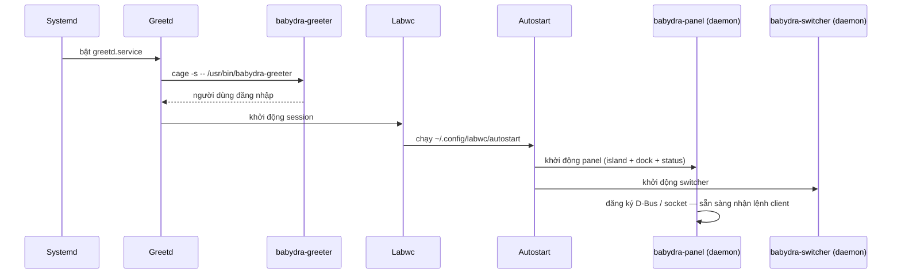

# 06 — Luồng hoạt động hệ thống

**Phạm vi:** luồng khởi động, daemon-client, luồng từng crate/lib — ai gọi ai, khi nào.
**Phiên bản:** 2.0.0
**Cập nhật lần cuối:** 2026-08-17

---

## 1. Luồng khởi động toàn hệ thống



---

## 2. Mô hình daemon-client

```text
Client (settings/launcher/lock…) ──socket | D-Bus──▶ Daemon (panel/switcher)
                                                        │
        cửa sổ đã nạp sẵn trong daemon ◀────────────────┘
```

- **Daemon** giữ cửa sổ nạp sẵn → hiện ngay, không lag.
- **Client** chạy oneshot: gửi tín hiệu, tự thoát.

---

## 3. Điểm chung: khởi động mọi app GTK

Mọi crate GTK đi theo cùng chuỗi (chi tiết: [02-architecture.md](./02-architecture.md) mục 3):

```text
activate() → init_theme() → load_babydra_config() → build_ui() → present()
```

`init_theme()` là điểm duy nhất nạp theme — đừng tự nạp CSS riêng.

---

## 4. Luồng từng thành phần

### babydra-core (lib)

```text
app gọi service → babydra_core::services::*  (wifi, vpn, volume, brightness…)
              → đọc/ghi config (~/.babydra/babydra.conf, cache OnceLock<RwLock>)
              → i18n::t(key) tra locales/*/{en,vi}.json
```

### babydra-ui-kit (lib)

```text
init_theme()  → sync GtkSettings/GSettings (color-scheme, icon-theme)
              → resolve theme → build_css → GtkCssProvider toàn cục
              → lắng nghe GSettings: đổi color-scheme → nạp lại CSS ngay
```

### babydra-theme (lib)

```text
resolve_theme(id) → themes_root() [env → ~/.babydra/themes → /usr/share → workspace]
                  → load_package (tokens.json + css) → merge base → trả 3 lớp CSS
```

### babydra-panel (daemon) — Island + dock + status + notification

```text
main → init_theme → khởi động 4 service nền (status, tray, clock, sys-monitor…)
     → build_panel_ui → island_tick 150ms (xem 07-dynamic-island.md)
     → lắng nghe config thay đổi → rebuild UI → cập nhật input region
     → lắng nghe lệnh client qua socket/D-Bus → hiện/ẩn cửa sổ
```

### babydra-island (lib) — chi tiết: [07-dynamic-island.md](./07-dynamic-island.md)

```text
island_tick (150ms): timer → feature ticks → arbitration → transition
```

### babydra-switcher (daemon)

```text
main (--daemon) → socket listener → message pump 8ms
               → nhận lệnh mở switcher → quét cửa sổ (wlrctl) → hiện overlay
               → Alt-Tab lặp → Enter chọn → gửi focus về labwc
```

### babydra-screenshot

```text
--full → grim toàn màn hình → save/clipboard
region/window → slurp chọn vùng → grim → editor overlay (cắt, chỉnh) → save
```

### babydra-lock

```text
kích hoạt → overlay fullscreen (che labwc) → nhập mật khẩu
          → xác thực PAM → thành công: ẩn overlay, quay lại session
```

### babydra-greeter (greetd)

```text
greetd → cage → chạy babydra-greeter → hiện form login (theme + wallpaper)
       → nhập user/pass → gửi session command về greetd → khởi động session
```

### babydra-settings

```text
CLI arg (--module) hoặc GUI → daemon-client gửi lệnh cho panel
     → hiện cửa sổ settings (tabs: sidebar + content) → áp dụng thay đổi qua core services
```

### babydra-explore

```text
tokio runtime + SessionState (một nguồn state)
     → content_view render theo state → sidebar/status_bar/info_panel đồng bộ
     → gestures: chuột phải context menu, kéo thả, clipboard
```

### babydra-launcher

```text
mở → scan ứng dụng (.desktop) → grid + fuzzy search
   → Enter → launch app → ẩn launcher
```

### babydra-preview

```text
mở ảnh → hiện viewer nhanh → mũi tên chuyển ảnh cùng folder → Esc thoát
```

### babydra-installer — chi tiết: [03-setup.md](./03-setup.md)

```text
event loop 50ms → wizard 10 bước → xác nhận → nhập sudo (modal) → worker thread
worker: preauth sudo → checkout branch → pull → cargo build --release
      → copy binaries/configs/themes → gửi InstallEvent về UI qua channel
```

---

## 5. Thứ tự đề xuất khi đọc

1. [01-overview.md](./01-overview.md) — bản đồ thành phần.
2. [02-architecture.md](./02-architecture.md) — pattern + sơ đồ tổng thể.
3. [03-setup.md](./03-setup.md) — cài & chạy được.
4. [06-system-flows.md](./06-system-flows.md) — trang này.
5. Đi sâu theo nhu cầu: island, theme, API, design.
