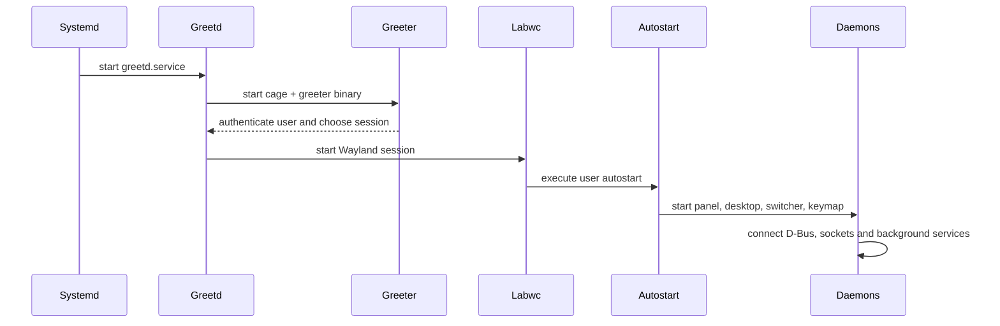
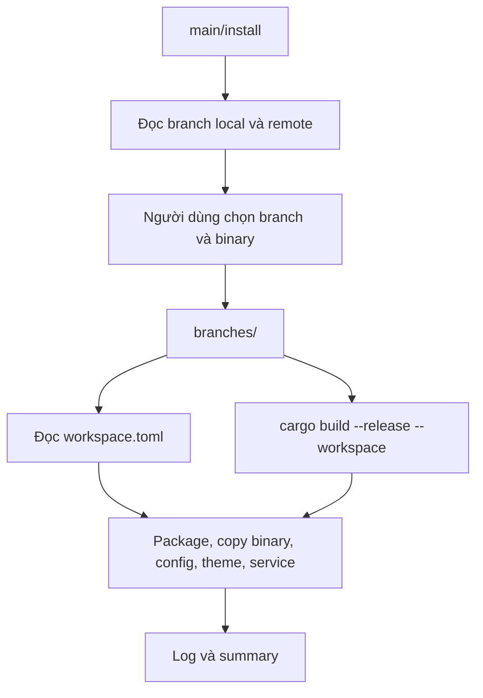

# 06 — Luồng hoạt động hệ thống

## Phạm vi

Trang này mô tả các luồng chính từ boot, khởi động session, giao tiếp giữa app và cài đặt branch.

## Luồng khởi động desktop



Cấu hình thực tế được lấy từ source branch: greetd config có thể được copy từ `configs/greetd/config.toml`; user service được phát hiện từ các file `.service` có section `[Unit]` và `[Service]`.

## Luồng của một GTK application

```text
process start
  → tạo GtkApplication
  → init_theme()
  → đọc babydra.conf
  → tạo state
  → dựng widget
  → kết nối service và signal
  → present hoặc chạy daemon loop
```

UI thread không thực hiện I/O dài. Service dùng callback, channel hoặc task nền rồi cập nhật state trên GTK main context.

## Daemon và client

```text
client application ── D-Bus / Unix socket ──> daemon
       │                                      │
       └── nhận trạng thái hoặc lệnh <────────┘
```

Daemon giữ các tài nguyên cần phản hồi nhanh, ví dụ panel hoặc switcher. Client mở theo nhu cầu, gửi lệnh hoặc tự quản lý một cửa sổ riêng.

## Luồng installer



### Discovery trước khi checkout

Khi installer đang chạy trên `main`, source tree chưa có. Installer dùng Git để đọc các ref có sẵn:

1. Tìm `workspace.toml` tại root của ref.
2. Nếu có manifest, lấy binary metadata từ đó.
3. Nếu không có, quét `Cargo.toml`, `src/main.rs` và `src/bin/*` trong tree.

### Discovery sau khi checkout

Sau khi tạo worktree, installer đọc manifest tại `branches/<branch>/workspace.toml`, build source và quét lại `target/release`. Nếu toàn bộ binary đang được chọn, binary mới xuất hiện sau build cũng được đưa vào install plan.

### Thực thi task

Task nhận manifest và source root, không tự biết danh sách app. Các task chính:

| Task | Nguồn dữ liệu |
| :--- | :--- |
| Package | `[packages]` trong `workspace.toml` |
| Binary copy | `[[binaries]]` và executable trong `target/release` |
| Desktop entry | File `.desktop` trong source hoặc binary có `export_desktop = true` |
| Dotfile | Các thư mục trực tiếp dưới `configs/` |
| Service | File systemd có section service hợp lệ trong source |
| Theme | `configs/themes/` và `themes/` |
| GSettings | `[gsettings]` |
| Greetd | `configs/greetd/config.toml` hoặc system binary scope `system` |

## Luồng Dynamic Island

```text
timer tick
  → feature tick
  → cập nhật dữ liệu
  → arbitration
  → chọn view thắng
  → hide view cũ
  → animate
  → show view mới
```

Chi tiết nằm trong [07 — Dynamic Island](07-dynamic-island.md).

## Luồng configuration

```text
user action
  → service trong babydra-core
  → system API / D-Bus
  → persist babydra.conf nếu cần
  → emit state update
  → UI render lại
```

Không để application tự gọi nhiều implementation khác nhau cho cùng một system service.
