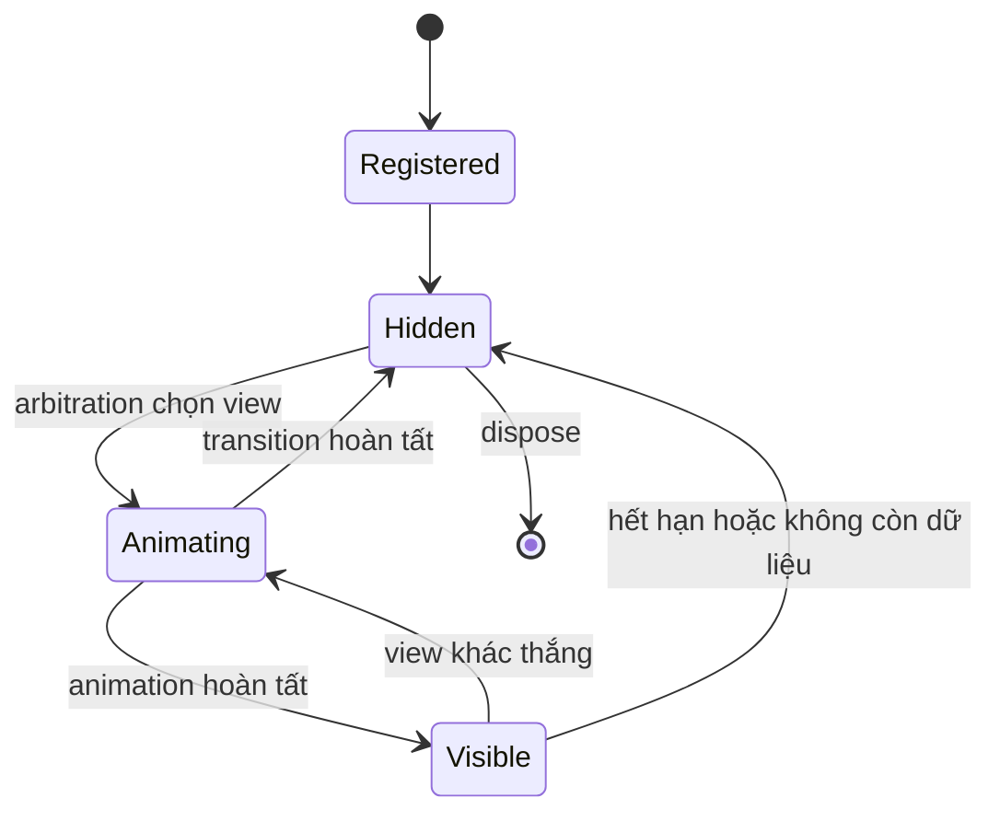

# 07 — Dynamic Island

## Phạm vi

Dynamic Island là vùng hiển thị trạng thái ngữ cảnh trong panel. Trang này mô tả runtime, vòng đời view và cách thêm feature mới.

## Cấu trúc module

```text
libs/babydra-island/src/
├── island/             Controller, core, view và handle
├── features/           Các feature ngữ cảnh
│   ├── default/
│   ├── media_player/
│   ├── notification/
│   ├── power/
│   ├── recording/
│   ├── clipboard/
│   └── system/
├── models/             Model và event dùng chung
└── render.rs           Dựng widget Island
```

Panel khởi tạo island và đăng ký feature. Library không nên phụ thuộc vào state riêng của panel.

## Runtime object

| Thành phần | Trách nhiệm |
| :--- | :--- |
| `Island` | API điều khiển, vòng đời và tick loop. |
| `IslandCore` | Danh sách view, state hiện tại và arbitration. |
| `ViewRecord` | Metadata của một view: feature, priority, state và sequence. |
| `IslandView` | Widget và callback hiển thị của feature. |
| `IslandViewHandle` | Kênh để service nền gửi dữ liệu vào island. |
| `ViewState` | `Hidden`, `Visible`, `Animating` hoặc trạng thái dispose tương ứng. |

## Vòng đời view



Mỗi tick gồm bốn bước:

1. Gọi `tick` của feature để cập nhật dữ liệu và yêu cầu hiển thị.
2. Chọn view dựa trên override, priority và thứ tự request.
3. Đóng view hiện tại nếu view thắng thay đổi.
4. Mở view mới sau khi transition trước đó hoàn tất.

## Arbitration

Override có quyền cao nhất và có thể chiếm island tạm thời. Nếu không có override, view được chọn theo priority. Khi priority bằng nhau, request mới hơn thắng để trạng thái mới được phản hồi trước.

Feature mặc định nên khai báo priority rõ ràng và không tự thay đổi layout của feature khác. Notification thường là trạng thái ngắn hạn; media hoặc system status có thể tồn tại lâu hơn.

## Thread và channel

GTK widget chỉ được đọc và sửa trên GTK main thread. Poller hoặc D-Bus listener chạy nền phải gửi model/event qua `IslandViewHandle`. Feature nhận dữ liệu trong tick hoặc callback của main context rồi cập nhật widget.

Khi panel rebuild:

1. Dừng loop và hủy handle cũ.
2. Dispose feature và timer.
3. Tạo island mới.
4. Đăng ký lại feature.
5. Khởi động tick loop mới.

## Thêm feature mới

Tạo cấu trúc:

```text
features/<feature-name>/
├── mod.rs
├── view.rs
├── render.rs
└── service.rs       # chỉ tạo nếu có poller hoặc listener nền
```

Triển khai interface của feature theo API hiện có trong `libs/babydra-island`:

```rust
impl IslandFeature for ExampleFeature {
    fn id(&self) -> &str { "example" }
    fn priority(&self) -> u8 { 50 }
    fn widget(&self) -> Option<gtk4::Widget> { /* render */ }
    fn on_show(&mut self) { /* bắt đầu hiển thị */ }
    fn on_hide(&mut self) { /* dừng hoặc dọn state */ }
}
```

Sau đó đăng ký feature trong builder hoặc factory của island, thêm test cho arbitration và kiểm tra khi feature không có dữ liệu.

## Quy tắc feature

- `id` duy nhất trong một island.
- Không giữ `Rc<RefCell<...>>` vượt quá phạm vi cần thiết.
- Dọn channel, timer và file descriptor khi dispose.
- Không block GTK main loop.
- Không hardcode màu hoặc spacing; dùng component và token chung.
