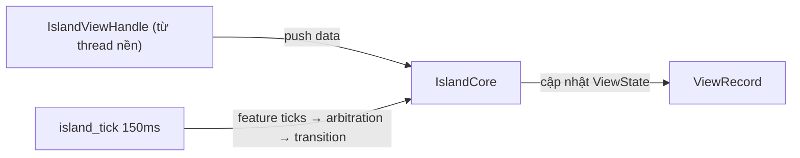

# 07 — Dynamic Island

**Phạm vi:** dùng island, kiến trúc runtime, vòng đời view/feature, tạo feature mới.
**Phiên bản:** 2.0.0
**Cập nhật lần cuối:** 2026-08-17

---

## 1. Tổng quan

Dynamic Island là thành phần hiển thị thông tin ngữ cảnh nổi trên màn hình (media player, notification, logo idle…). Mỗi **feature** là một view độc lập đăng ký vào engine; engine quyết định **feature nào hiện tại mỗi thời điểm** qua arbitration.

```text
libs/babydra-island/src/
├── island/            ← Island, IslandCore, IslandView, IslandViewHandle
├── features/          ← 3 feature mặc định
│   ├── default/       ← logo idle (khi không có gì khác)
│   ├── media_player/  ← mod.rs, view.rs, render.rs, poll.rs, art.rs, popover.rs, visualizer.rs, format.rs
│   └── notification/  ← mod.rs, view.rs, render.rs, service.rs
├── models/            ← dữ liệu dùng chung
├── render.rs          ← dựng island widget
└── widgets/           ← re-export widget notification
```

API public re-export: `default_island`, `Island`, `IslandBuilder`, `IslandConfig`, `IslandFeature`, `IslandView`, `IslandViewHandle`, `build_default_island`, `create_system_island`.

---

## 2. Các thành phần runtime

| Thành phần | Vai trò |
| :--- | :--- |
| `Island` | Controller — giữ core, chạy loop, arbitrate |
| `IslandCore` | State trung tâm: danh sách view, feature đang hiển thị |
| `ViewRecord` | Bản ghi một view đã đăng ký (feature, priority, state, index) |
| `ViewState` | Trạng thái view: `Hidden`, `Visible`, `Animating`, `Disposed` |
| `IslandViewHandle` | Handle cho phép feature đẩy dữ liệu vào island từ thread nền |



---

## 3. Vòng đời một view

```mermaid
stateDiagram-v2
    [*] --> Register: IslandView::new + register
    Register --> Hidden
    Hidden --> Animating: arbitration chọn view này (on_show)
    Animating --> Visible: animation xong
    Visible --> Animating: bị thay thế (on_hide)
    Animating --> Hidden
    Visible --> Hidden: hết hạn (notification 5s)
    Hidden --> [*]: dispose
```

Mỗi tick, controller:

```text
1. Timer (150ms)
2. Feature ticks — mỗi feature cập nhật dữ liệu / yêu cầu hiện/ẩn
3. Arbitration — chọn 1 view thắng
4. Transition — on_hide view cũ → animate expand/collapse → on_show view mới
```

---

## 4. Arbitration (chọn view hiển thị)

Thuật toán 2 vòng:

1. **Override thắng tuyệt đối** — view nào yêu cầu override (vd notification đang đọc, media đang phát) chiếm vị trí, các view khác bị ẩn.
2. Không có override → chọn theo `(priority, request_seq, index)`.

| Feature | Priority | Ghi chú |
| :--- | :--- | :--- |
| Notification | cao nhất | Chiếm ưu tiên khi có thông báo mới |
| Media player | trung bình | Hiển thị khi có player đang phát |
| Idle logo (default) | thấp nhất | Chỉ hiện khi không có feature nào khác |

> [!IMPORTANT]
> Có cơ chế **ghi đè luôn hiển thị**: feature có thể yêu cầu giữ màn hình (vd luôn hiện player), và bị ghi đè tạm thời bởi notification trong một khoảng thời gian, sau đó trả lại — tránh kẹt layout.

### Transition & chống kẹt

- Transition dùng cơ chế `pending`: view cũ chờ `on_hide` xong mới tới view mới.
- `animating` được reset 2 lần (double-reset) để tránh trạng thái dính giữa các lần chuyển.

---

## 5. Luồng từng feature mặc định

### 5.1. Media player

```text
thread poll playerctl (1s) → channel → cache
  → tick: có player đang phát? → yêu cầu hiện → render (title, artist, art, progress)
  → artwork: thread tải ảnh bìa + retry nếu lỗi
  → popover / visualizer đi kèm
```

### 5.2. Notification

```text
D-Bus (org.freedesktop.Notifications) → SHARED_NOTIFICATION
  → tick: có thông báo? → hiện (đo chiều cao động) → hover: kéo dài thời gian
  → hết hạn 5s → ẩn → click: focus app nguồn
```

### 5.3. Idle logo (default)

- Hiển thị khi **không có feature nào khác** hoạt động.
- Kích thước chuẩn: 28×16 (banner hẹp).

---

## 6. Thread, channel & dọn dẹp

| Luồng | Việc | Thoát khi |
| :--- | :--- | :--- |
| Controller loop | `island_tick` mỗi 150ms | island bị drop / panel thoát |
| Poll playerctl | Đọc trạng thái player mỗi 1s | media feature bị dispose |
| Artwork | Tải ảnh bìa (retry) | xong / dispose |
| Notification (D-Bus) | Lắng nghe thông báo | feature bị dispose |

Panel rebuild: dừng loop cũ → dựng island mới → đăng ký lại features → chạy loop mới.

---

## 7. Tạo feature mới

### 7.1. Cấu trúc chuẩn

```text
features/<tên-feature>/
├── mod.rs       ← struct + constructor + impl IslandFeature
├── view.rs      ← state hiển thị, model dữ liệu
├── render.rs    ← dựng widget từ view
└── service.rs   ← (tùy chọn) thread nền, channel, poll
```

### 7.2. Triển khai `IslandFeature`

```rust
impl IslandFeature for MyFeature {
    fn id(&self) -> &str { "my_feature" }          // định danh duy nhất
    fn priority(&self) -> u8 { 50 }                // cho arbitration
    fn widget(&self) -> Option<gtk4::Widget> { ... }
    fn on_show(&mut self) { ... }                  // chuẩn bị trước khi hiện
    fn on_hide(&mut self) { ... }                  // dọn dẹp khi bị ẩn
}
```

### 7.3. Đăng ký vào island

```rust
let mut island = IslandBuilder::new()
    .with_feature(Box::new(MyFeature::new(handle.clone())))
    .build();
island.register_view(IslandView::new("my_feature", ...));
```

### 7.4. Đẩy dữ liệu từ thread nền

```rust
// trong thread poll/service
handle.send(my_data);   // IslandViewHandle → IslandCore → cập nhật view
```

Quy tắc: mỗi feature 1 folder, đúng cấu trúc chung, file < ~300 dòng (tách view/render/service khi dài).
