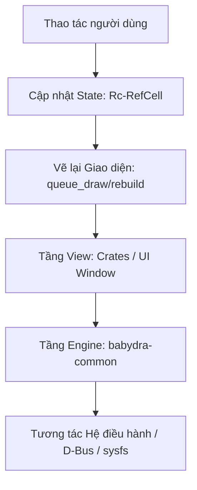

# Kiến trúc dự án BabyDra: Hướng thiết kế, Thiết lập và Hoạt động

Tài liệu này tập trung làm rõ 3 trụ cột kỹ thuật của dự án **BabyDra**: hướng thiết kế mã nguồn, phương pháp thiết lập hệ thống giao diện và luồng hoạt động thực tế của các dịch vụ.

---

## 1. Hướng thiết kế mã nguồn (Code Design Patterns)

Dự án áp dụng 4 nguyên lý thiết kế phần mềm cốt lõi để đảm bảo hệ thống phản hồi cực nhanh, dễ bảo trì và mở rộng:

### 1.1. Phân tách Giao diện và Nghiệp vụ (Decoupled View-Logic)
- **Tầng View (GUI Layer):** Các ứng dụng đồ họa đóng vai trò làm lớp hiển thị bên ngoài. Chúng chỉ chịu trách nhiệm bắt sự kiện tương tác của người dùng và hiển thị thông tin lên widget GTK.
- **Tầng Engine (Core Logic):** Toàn bộ nghiệp vụ tính toán, tương tác với hệ điều hành (đọc ghi tệp tin `/sys/class`, điều khiển phần cứng Wifi/Bluetooth, quản lý DBus daemon) đều được đóng gói thành các hàm API độc lập trong thư viện lõi. Tầng View gọi API này để lấy dữ liệu thay vì tự tương tác trực tiếp với hệ thống.

### 1.2. Hướng trạng thái & Luồng dữ liệu một chiều (State-Driven UI & Unidirectional Flow)
- Giao diện UI không quản lý trực tiếp dữ liệu thô. Mọi cửa sổ phức tạp đều liên kết với một cấu trúc trạng thái duy nhất được chia sẻ thông qua con trỏ đếm tham chiếu `Rc<RefCell<T>>`.
- Luồng hoạt động chạy một chiều:
  1. Người dùng tương tác (nhấp chuột, gõ phím) -> Kích hoạt thay đổi giá trị của cấu trúc trạng thái (`State`).
  2. State được cập nhật -> Phát tín hiệu yêu cầu vẽ lại hoặc tái tạo cây widget tương ứng (`queue_draw` hoặc rebuild) để đồng bộ hiển thị lên màn hình.

### 1.3. Kiến trúc Daemon-Client tối ưu hóa hiệu năng
- Do khởi động lạnh một ứng dụng GTK (cold start) tốn hàng trăm mili-giây, dự án áp dụng mô hình **Daemon-Client** để triệt tiêu độ trễ:
  - Một tiến trình Daemon chạy ngầm duy trì cửa sổ giao diện ẩn trong bộ nhớ.
  - Khi phím tắt được kích hoạt, một client siêu nhẹ bắn thông báo qua **Unix Domain Socket** hoặc **D-Bus**.
  - Daemon lập tức nhận tín hiệu và gọi hiển thị trực tiếp cửa sổ (`.set_visible(true)` và `.present()`), đưa tốc độ hiển thị về mức tức thì (< 10ms).

### 1.4. Thiết kế mô-đun hóa giao diện (Componentized UI)
- Toàn bộ linh kiện giao diện (nút bấm, thanh trượt, hộp thoại) và quy tắc CSS được tách biệt khỏi ứng dụng cụ thể. Thư viện UI chung đóng vai trò là Styling Engine trung tâm, tự động gộp các file CSS và nạp vào GDK Display Context, đảm bảo tính nhất quán thị giác trên toàn hệ thống.

---

## 2. Cách thức thiết lập giao diện (UI Setup Methods)

Để xây dựng một cửa sổ giao diện chuẩn mực trên Wayland, dự án áp dụng quy trình thiết lập gồm 3 bước:

### Step 1: Cấu hình Layer Shell (Layer Shell Initialization)
Dự án sử dụng `gtk4-layer-shell` để định vị cửa sổ ứng dụng trên máy chủ hiển thị Wayland:
- **Xác định tầng lớp hiển thị (`Layer`):**
  - Sử dụng `Layer::Top` cho các thanh trạng thái hệ thống (Panel) để luôn nổi trên các ứng dụng thông thường.
  - Sử dụng `Layer::Overlay` cho các cửa sổ cần bao phủ toàn màn hình (như Alt-Tab Switcher, Locker, Screenshot).
- **Neo cạnh màn hình (`Edge`):** Sử dụng các hàm neo cạnh (ví dụ: neo trên, trái, phải đối với thanh Panel) để cố định vị trí hiển thị.
- **Vùng loại trừ (`exclusive_zone`):** Thiết lập vùng loại trừ kích thước cụ thể để hệ thống tự động chừa không gian hiển thị, tránh việc các ứng dụng khác phóng to đè lên cửa sổ hệ thống.

### Step 2: Áp dụng Stylesheet toàn cục (Style Injection)
- Khi cửa sổ khởi chạy, hàm khởi tạo theme [init_theme](file:///home/i4104/BabyDra/libs/babydra-utils/src/ui/theme/mod.rs#L76) được gọi.
- Hệ thống lắng nghe biến cấu hình từ GSettings để phát hiện chế độ Dark/Light hiện tại.
- Nạp động toàn bộ nội dung mã CSS tương ứng từ thư mục theme của thư viện dùng chung vào `GtkCssProvider` toàn cục.

### Step 3: Đăng ký các dịch vụ chạy ngầm (Background Listeners Setup)
- Khởi động luồng chạy ngầm để phục vụ lấy thông tin hệ thống (như dịch vụ theo dõi ứng dụng tiêu điểm, D-Bus notification server).
- Đăng ký bộ lắng nghe sự kiện đóng/mở cửa sổ để kích hoạt hiệu ứng động (ví dụ: hiệu ứng Genie macOS co giãn khi tắt mở).
